# Sentinel V2 — MiniOmni Migration

Status: **Active Development**  
Base: **Sentinel V1** (tag: `v1.0-whisper-final`)

---

## Primary Objective
Replace the cascaded Whisper (ASR) $\rightarrow$ Ollama/Qwen (LLM) $\rightarrow$ Kokoro (TTS) pipeline with a **native speech-to-speech model (MiniOmni2)**, achieving ultra-low latency, native emotional expression, and voice-to-voice reasoning while preserving Sentinel's core agent capabilities:
1. **Dynamic Tools**: Maintaining local tool execution (such as time/date checks, system controls, etc.).
2. **Persistent Graph Memory**: Preserving the `GraphMemoryStore` (user facts, directives, and snapping snapshots).
3. **Identity and Tone**: Preserving Sentinel's core persona ("Boss", professional but alert).

---

## Architectural Comparison

```mermaid
graph TD
    %% Sentinel V1 Cascaded Architecture
    subgraph V1 ["Sentinel V1 (Cascaded Pipeline)"]
        A[User Audio Stream] -->|WebSockets| B[Silero VAD]
        B -->|Stitch Speech Buffer| C[Faster-Whisper ASR]
        C -->|Text Query| D[Google ADK + Ollama/Qwen]
        D -->|Text Response| E[Kokoro TTS]
        E -->|Audio Chunk Stream| F[Frontend Audio Queue]
    end

    %% Sentinel V2 Native Audio Architecture
    subgraph V2 ["Sentinel V2 (Native Speech-to-Speech)"]
        G[User Audio Stream] -->|Streaming WebSockets| H[VAD / Activity Detector]
        H -->|Audio Tokens / Waveform| I[MiniOmni2 Model]
        I -->|Direct Audio Stream| J[Frontend Audio Queue]
        I -.->|Parallel Text / Thoughts| K[Google ADK + Tools / Memory]
    end
    
    style V1 fill:#2a1b3d,stroke:#a64b2a,stroke-width:2px,color:#fff
    style V2 fill:#1b3d2a,stroke:#4caf50,stroke-width:2px,color:#fff
```

---

## Key Challenges & Technical Migration Strategy

### 1. Unified Audio Streaming (Real-Time Duplex)
*   **V1 Approach**: Client streams audio $\rightarrow$ VAD boundary met $\rightarrow$ Backend transcribes $\rightarrow$ LLM reasons $\rightarrow$ TTS synthesizes $\rightarrow$ Frontend plays sequentially.
*   **V2 Migration**: MiniOmni2 supports streaming input-output directly. We will adapt the WebSocket interface to pass audio packets directly to/from the MiniOmni2 forward loop, achieving sub-second response times.

### 2. Preserving Tools & Memory Integration (Google ADK)
*   **Challenge**: Speech-to-speech models output speech directly, which complicates the text-based function-calling loop of the Google Agent Development Kit (`google-adk`).
*   **V2 Strategy**:
    1. Utilize MiniOmni2's parallel text output channel to capture textual reasoning.
    2. Hook the text output stream into ADK's `LlmAgent` tool-call parser.
    3. If a tool call is detected (e.g., `remember_fact`), pause/interrupt audio output, execute the tool, feed the tool response back into MiniOmni's context, and resume.

### 3. Native Barge-in
*   **V1 Approach**: Silero VAD monitors incoming audio during TTS playback, sending a WebSocket interrupt signal to wipe the client audio queue.
*   **V2 Migration**: Leverage MiniOmni2's native multi-turn streaming capabilities to automatically detect user barge-in and truncate its own output generation.

---

## Phased Action Plan

### Phase 1: Environment & Dependency Setup
*   Integrate PyTorch-based MiniOmni2 repository dependencies.
*   Verify CUDA hardware acceleration compatibility for real-time speech tokenization and generation.

### Phase 2: Core Speech-to-Speech Loop
*   Create a prototype service (`miniomni_service.py`) running MiniOmni2 locally.
*   Build a test loop executing speech-to-speech completions directly on pre-recorded audio waveforms.

### Phase 3: WebSocket Streaming Integration
*   Refactor `backend/app/api/websocket.py` to stream input PCM frames directly to the model's audio encoder.
*   Implement real-time audio chunk generation from the model's audio decoder back to the browser.

### Phase 4: Tools & Memory Bridge
*   Connect the textual reasoning stream to the existing memory and control tools.
*   Verify that S.E.N.T.I.N.E.L. can still save facts and apply system commands.
