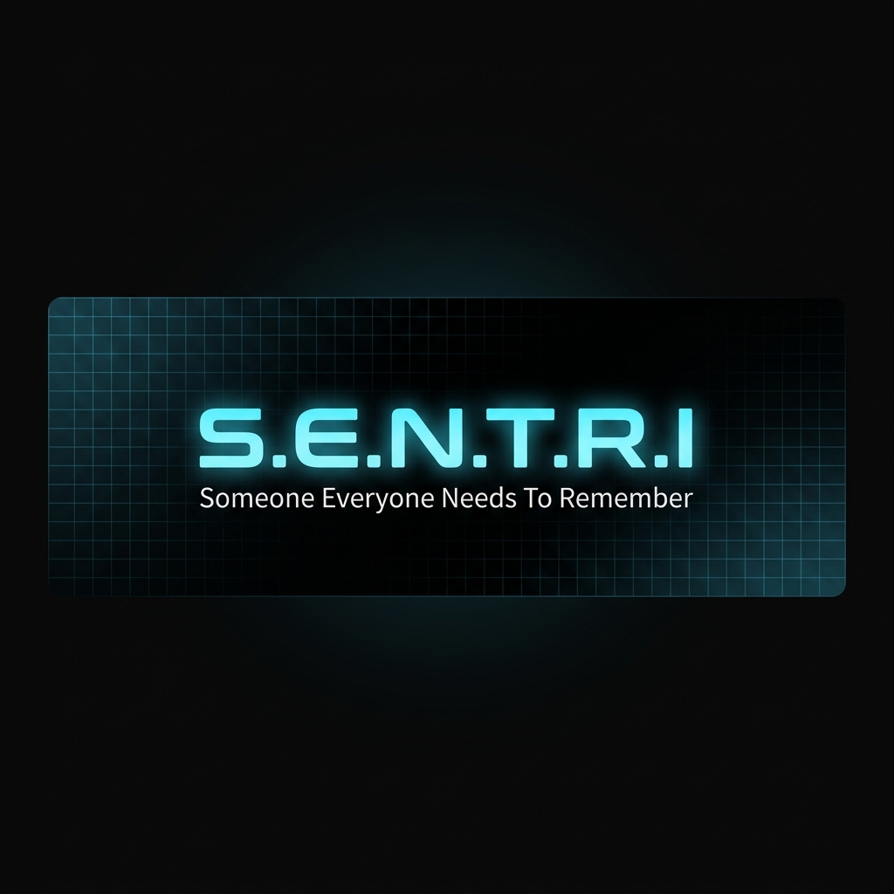
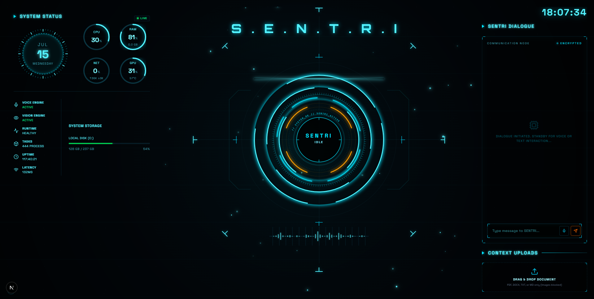

<div align="center">



<br>
<br>

<p>
<a href="#-quick-start"></a>
<a href="#-architecture"></a>
<a href="#-project-structure"></a>
</p>

<br>

<table>
<tr>
<td>
<strong>A fully local, real-time voice AI companion with persistent memory,<br>autonomous tool execution, and a sci-fi HUD interface —<br>running entirely on your own hardware.</strong>
</td>
</tr>
</table>

<br>

<p>


</p>

</div>

<br>

<div align="center">

<br>
<sub><i>The SENTRI HUD — real-time system metrics, voice waveforms, and conversational interface</i></sub>
</div>

<br><br>

---

<br>

<h2 align="center">What is S.E.N.T.R.I?</h2>

<p align="center">
SENTRI is not a chatbot. It's a <strong>personal AI operating system</strong> — a digital companion<br>
that listens, speaks, remembers, and acts. Every component runs locally.<br>
No cloud APIs. No telemetry. No data leaves your machine.
</p>

<br>

---

<br>

<h2 align="center">◆ Capabilities</h2>

<br>

<table>
<tr>
<td align="center" width="50%">
<br>
<h3>🎙️ Real-Time Voice</h3>
<p>Sub-second voice pipeline with concurrent workers.<br>TTS begins while the LLM is still generating.</p>
<br>
<table>
<tr><td><strong>ASR</strong></td><td>Faster-Whisper · GPU · In-Process</td></tr>
<tr><td><strong>LLM</strong></td><td>Ollama · Qwen3.5-4B · Local</td></tr>
<tr><td><strong>TTS</strong></td><td>Kokoro ONNX · GPU · In-Process</td></tr>
</table>
<br>
</td>
<td align="center" width="50%">
<br>
<h3>🧠 Persistent Memory</h3>
<p>Graph-based long-term memory that extracts<br>and recalls facts across sessions.</p>
<br>
<table>
<tr><td><strong>Storage</strong></td><td>SQLite graph with semantic retrieval</td></tr>
<tr><td><strong>Extraction</strong></td><td>Automatic from natural conversation</td></tr>
<tr><td><strong>Recall</strong></td><td>Injected into every turn as context</td></tr>
</table>
<br>
</td>
</tr>
<tr>
<td align="center" width="50%">
<br>
<h3>🛠️ Autonomous Tools</h3>
<p>The model decides which tools to invoke.<br>13 workspace tools, zero-config.</p>
<br>
<table>
<tr><td><strong>Filesystem</strong></td><td>list · read · tree · search</td></tr>
<tr><td><strong>Code Intel</strong></td><td>architecture · module · dependencies</td></tr>
<tr><td><strong>External</strong></td><td>web search · memory · open resource</td></tr>
</table>
<br>
</td>
<td align="center" width="50%">
<br>
<h3>🪐 Sci-Fi HUD</h3>
<p>Immersive dashboard with live system metrics,<br>particle fields, and orbital animations.</p>
<br>
<table>
<tr><td><strong>Gauges</strong></td><td>CPU · RAM · Network · Disk</td></tr>
<tr><td><strong>Visuals</strong></td><td>Orbitals · Particles · Waveforms</td></tr>
<tr><td><strong>Interface</strong></td><td>Event stream · Voice · Chat</td></tr>
</table>
<br>
</td>
</tr>
</table>

<br>

---

<br>

<h2 align="center">◆ Architecture</h2>

<br>

<p align="center">
Strict layered dependencies — outer layers depend on inner abstractions,<br>
inner layers never depend on outer implementations.
</p>

<br>

```
                           ┌─────────────────────────────────┐
                           │        Browser Client           │
                           │    Next.js · Tailwind · WebAudio│
                           └──────────┬──────────────────────┘
                                      │
                         WebSocket (PCM16 ↕ Audio + JSON)
                                      │
                           ┌──────────▼──────────────────────┐
                           │        WebSocket API            │
                           └──────────┬──────────────────────┘
                                      │
                           ┌──────────▼──────────────────────┐
                           │     Conversation Engine         │
                           │  ┌─────────┐ ┌──────────────┐  │
                           │  │ Memory  │ │Prompt Builder │  │
                           │  └─────────┘ └──────────────┘  │
                           └──────────┬──────────────────────┘
                                      │
              ┌───────────────────────▼────────────────────────┐
              │          Streaming Speech Pipeline             │
              │                                                │
              │   ┌───────┐  ┌─────────┐  ┌───────────────┐   │
              │   │  ASR  │  │Reasoning│  │Speech Planner │   │
              │   │Whisper│  │ Ollama  │  │  (Chunker)    │   │
              │   └───────┘  └────┬────┘  └───────────────┘   │
              │                   │                            │
              │             ┌─────▼─────┐  ┌──────────────┐   │
              │             │   Tools   │  │     TTS      │   │
              │             │ Registry  │  │   Kokoro     │   │
              │             └───────────┘  └──────────────┘   │
              └────────────────────────────────────────────────┘
```

<br>

> **Provider Independence** — Every provider (ASR, Reasoning, TTS) is a standalone module with zero cross-dependencies. Swapping Faster-Whisper for Moonshine, or Kokoro for Piper, requires writing one driver file and touching nothing else.

<br>

---

<br>

<h2 align="center">◆ Project Structure</h2>

<br>

```
S.E.N.T.R.I/
│
├── backend/                          Python · FastAPI
│   ├── app/
│   │   ├── api/                      WebSocket & System Stats endpoints
│   │   ├── conversation/
│   │   │   ├── engine.py             Routes voice & text turns
│   │   │   ├── adapter.py            Text reasoning adapter (Ollama)
│   │   │   └── streaming_pipeline/
│   │   │       ├── pipeline.py       4-worker concurrent voice runtime
│   │   │       ├── chunker.py        Sentence-aware speech planner
│   │   │       └── providers/        ASR / Reasoning / TTS drivers
│   │   ├── memory/                   Graph memory & semantic retrieval
│   │   ├── runtime/                  Model lifecycle & state machine
│   │   ├── tasks/                    Tool schemas & execution registry
│   │   └── Sentri/Instructions/      Personality & system prompt
│   └── .env                          Model & voice configuration
│
├── frontend/                         TypeScript · Next.js · Tailwind
│   ├── src/
│   │   ├── components/
│   │   │   ├── core/                 Orbitals · Backdrop · Grid · Waveform
│   │   │   ├── panels/              Status · Events · Commands
│   │   │   └── ui/                   Circular gauges · Calendar widgets
│   │   ├── hooks/                    useVoice · useSystemStats
│   │   ├── services/                 Audio · Speech · WebSocket
│   │   └── store/                    Voice state management
│   └── public/                       AudioWorklet · VAD model
│
└── Docs/
    ├── decisions/                    9 Architecture Decision Records
    └── Tests/                        Evaluation & stress test reports
```

<br>

---

<br>

<h2 align="center">▶ Quick Start</h2>

<br>

### Prerequisites

<table>
<tr>
<th>Requirement</th>
<th>Minimum</th>
<th>Recommended</th>
</tr>
<tr><td><strong>Python</strong></td><td>3.10+</td><td>3.11+</td></tr>
<tr><td><strong>Node.js</strong></td><td>18+</td><td>20+</td></tr>
<tr><td><strong>Ollama</strong></td><td>Installed & running</td><td>Latest</td></tr>
<tr><td><strong>GPU</strong></td><td>Any CUDA-capable</td><td>RTX 3060 12GB+</td></tr>
<tr><td><strong>OS</strong></td><td>Windows 10</td><td>Windows 11</td></tr>
</table>

<br>

### Step 1 · Pull the Model

```bash
ollama pull hf.co/HauhauCS/Qwen3.5-4B-Uncensored-HauhauCS-Aggressive:Q4_K_M
```

### Step 2 · Auto-Downloaded Assets

| Model | Size | When |
|---|---|---|
| Faster-Whisper `base` | ~150 MB | First backend startup |
| Kokoro ONNX v1.0 + voices | ~100 MB | First backend startup |
| [Silero VAD v5](https://github.com/snakers4/silero-vad) | ~2 MB | Place in `frontend/public/` |

### Step 3 · Launch

**One-click (Windows):**
```bash
run_sentri.bat
```

**Manual:**
```bash
# Terminal 1 — Backend
cd backend
.\venv\Scripts\activate
pip install -r requirements.txt
uvicorn app.main:app --reload --port 8008

# Terminal 2 — Frontend
cd frontend
npm install
npm run dev -- -p 3030
```

Open **[localhost:3030](http://localhost:3030)** → talk to SENTRI.

<br>

---

<br>

<div align="center">

<br>

Built by [**NeuralNinja23**](https://github.com/NeuralNinja23)

<sub>Someone Everyone Needs To Remember.</sub>

<br><br>

</div>
